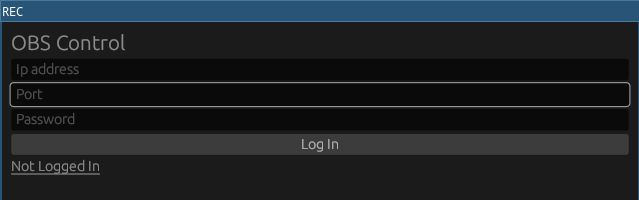
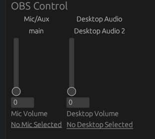
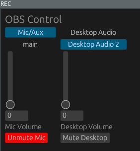

# REC (WIP)
GUI interface for OBS over Websockets written in Rust using [obws](https://github.com/dnaka91/obws)  and [egui](https://github.com/emilk/egui) 

## Screenshots
### Login
 
### List inputs
 
### Selection 
 
